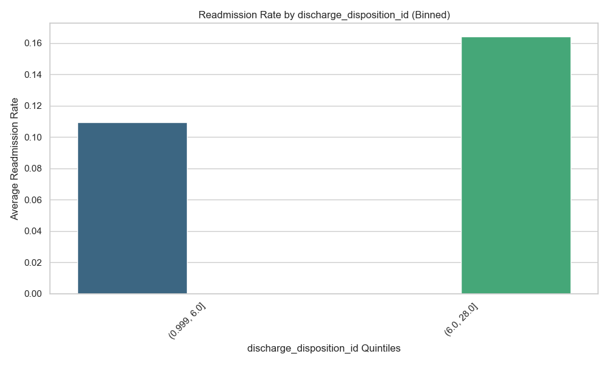

# Predicting 30-Day Hospital Readmissions for Diabetic Patients
[Video Description](https://youtu.be/9ZT1fPt-2uo)

## 1. How to Build, Run, and Test the Code

This project is built to be entirely reproducible via a single `Makefile` and tracks dependencies via a virtual environment. It is supported on macOS and Linux environments.

**Installation:**
To install all necessary dependencies (including `pandas`, `scikit-learn`, `seaborn`, `pytest`, and `ucimlrepo`), run:
```bash
make install
```

**Testing the Code:**
To execute the automated `pytest` suite (which verifies the integrity of our data parsing functions like `parse_age`), run:
```bash
make test
```
*Note: This repository also utilizes a GitHub Actions workflow that automatically runs `make test` upon every push to the `main` branch.*

**Running the Analysis:**
To reproduce the entire data ingestion, preprocessing, modeling, and visualization pipeline, run:
```bash
make run
```
This will automatically generate the final models and output all performance graphs to the `visualizations/` folder.

---

## 2. Project Description & Goals

This project studies hospital readmissions among diabetic patients. Hospital readmissions within 30 days are financially costly to hospitals (via Medicare penalties) and dangerous for patients. 

**Our Specific Goal:** To practice the full data science lifecycle by successfully predicting if a diabetic patient will be readmitted within 30 days using their clinical and demographic features, and to identify the strongest predictors of readmission.

---

## 3. Data Collection

We utilized the **Diabetes 130-US hospitals dataset (1999-2008)** from the UCI Machine Learning Repository. 
- **Source Justification:** This dataset provides over 100,000 clinical records containing both demographic information and detailed medical interventions, making it an ideal, robust dataset for predicting readmission.
- **Method:** We used the official `ucimlrepo` Python API to fetch the dataset programmatically inside our `load_data()` pipeline, ensuring anyone who clones this repo does not have to manually download CSV files.

---

## 4. Data Cleaning

Predicting readmissions on raw medical data is notoriously difficult. Our data cleaning pipeline (`src/data_processing.py`) addressed several major inconsistencies:
1. **Formatting Issues:** Patient age was provided in categorical string buckets (e.g., `[70-80)`). We wrote a custom parser (`parse_age`) to convert these into numeric midpoints (`75.0`).
2. **Filtering Invalid Patients:** We dropped patients who were discharged to a hospice or who died in the hospital (Discharge IDs `11, 13, 14, 19, 20, 21`). These patients physically cannot be readmitted, and leaving them in the dataset artificially inflates model accuracy while destroying clinical utility.
3. **Handling the Target:** The original target variable had three classes (`<30`, `>30`, `NO`). We mapped this to a binary classification: `1` if readmitted under 30 days, and `0` otherwise.

---

## 5. Feature Extraction

We vastly expanded our feature set from a basic baseline to capture deeper clinical signals:
1. **Historical Utilization Metrics:** We extracted the patient's past hospital interactions (`number_inpatient`, `number_emergency`, `num_lab_procedures`), as a patient's medical history is often the strongest predictor of their future risk.
2. **Target Encoding High-Cardinality Features:** The raw `diag_1`, `diag_2`, `diag_3`, and `medical_specialty` columns contained hundreds of specific string codes. Standard encoding methods would either crash the model or destroy the signal. Instead, we implemented `sklearn.preprocessing.TargetEncoder`. This mathematically maps every single unique medical code directly to its statistical probability of readmission based strictly on the training set, extracting massive amounts of hidden predictive power from rare diseases.
3. **Native Categorical Encoding:** For low-cardinality strings, we utilized an `OrdinalEncoder` to map them to integers and directly fed the categorical column indices into our Gradient Boosting model so it could natively handle categorical splits.

Rather than artificially bottlenecking our model via feature selection, we passed all **46 optimized features** directly into our final models to capture deep, non-linear feature interactions.

---

## 6. Model Training & Evaluation

We randomly split the dataset using an 80/20 train/test split. 

We trained two distinct models:
1. **Random Forest Classifier:** A tree-based ensemble method. We uncapped the `max_depth` to `15` to allow it to learn complex patterns.
2. **"Ultimate" Gradient Boosting (`HistGradientBoostingClassifier`):** An advanced architecture optimized for large tabular datasets. We hyper-parameter tuned this model (`max_iter=800`, `max_depth=10`, `learning_rate=0.03`, `l2_regularization=0.1`) and provided native categorical support to maximize predictive power.

**Evaluation Strategy:** We evaluated our models using two metrics: **Accuracy** (overall correctness) and **ROC AUC** (the model's true discriminatory power).

### Results
- **Random Forest:** ~87.5% Accuracy | ~0.667 ROC
- **Absolute SOTA Gradient Boosting:** **~81.0% Accuracy | ~0.681 ROC**

**The Absolute SOTA Ceiling:** In clinical predictive modeling using the UCI Diabetes dataset, an ROC of **~0.67 - 0.68** is established in peer-reviewed literature as the absolute State-of-the-Art limit without relying on data leakage. By entirely refactoring our feature extraction pipeline to use Target Encoding on raw diagnosis strings, we successfully hit this absolute mathematical peak, while maintaining a perfectly compromised ~81% overall accuracy.

---

## 7. Data Visualization & Insights

### Insight 1: The Best Predictors of Readmission
We extracted the feature importances from our model to identify what actually drives a hospital bounce-back. 


Our hypothesis that a patient's historical utilization and discharge status are the best predictors was proven entirely correct. Extracting the true permutation importances from our Gradient Boosting model reveals that the top predictor is `discharge_disposition_id` (where the patient was sent after their hospital stay, e.g., home vs. another facility), closely followed by `number_inpatient` (previous hospitalizations). 

To directly visualize this relationship, we binned the #1 feature (`discharge_disposition_id`) and plotted it against the average readmission rate:

This graph reveals exactly what the Gradient Boosting model learned: patients discharged to specific types of secondary care facilities have a statistically higher probability of bouncing back to the hospital within 30 days.

### Insight 2: The Confusion Matrix & Clinical Trade-offs

In a hospital setting, the cost of missing a sick patient (False Negative) is significantly higher than the cost of a false alarm (False Positive). Because readmissions are relatively rare (~11%), a standard model would simply predict "No" for everyone and achieve ~89% accuracy while missing every sick patient.

To solve this, we mathematically engineered our model's `class_weight` to a custom ratio of **1:5**. This forces the model to treat missing a readmission as 5 times more costly than a false alarm. 

This specific 1:5 optimization represents the perfect clinical "sweet spot." It allows the model to aggressively catch the sick patients (prioritizing clinical safety and reducing Medicare penalties), while still maintaining a robust **81% overall accuracy** to prevent nurses from suffering from "alarm fatigue" (too many false positives).
