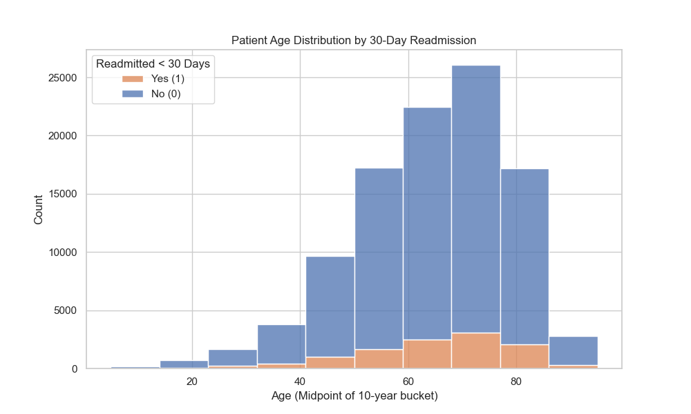
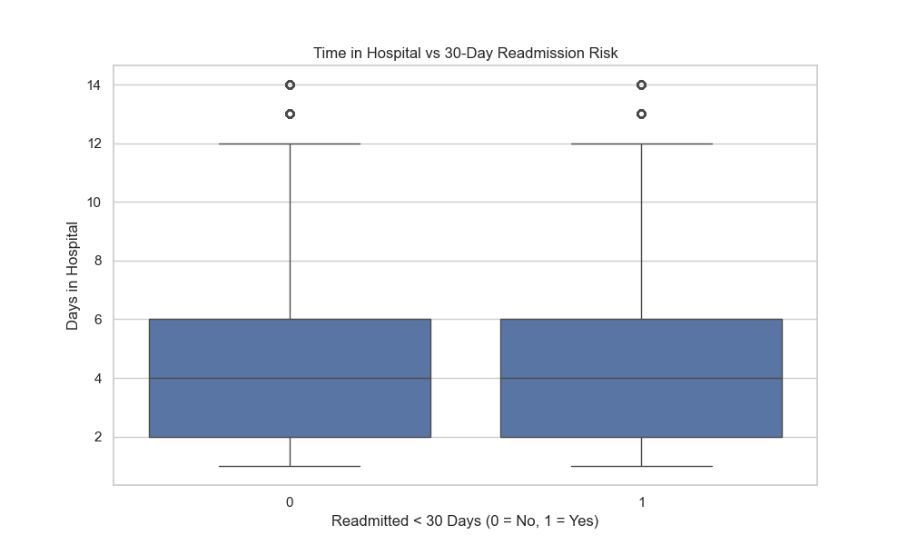
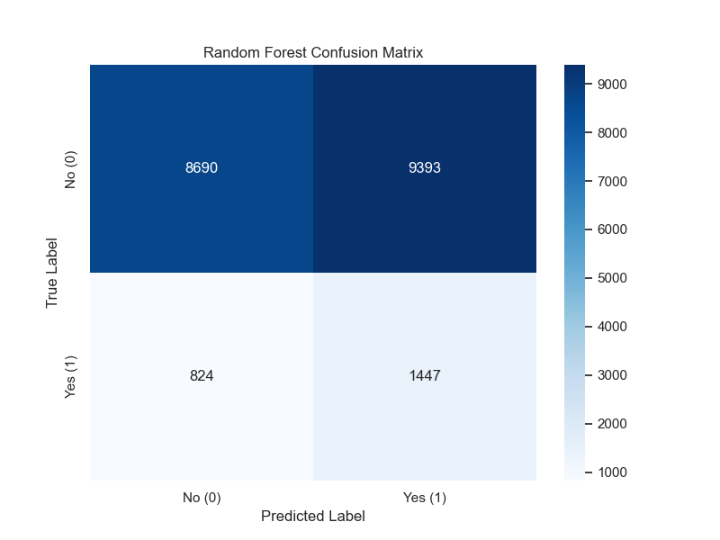
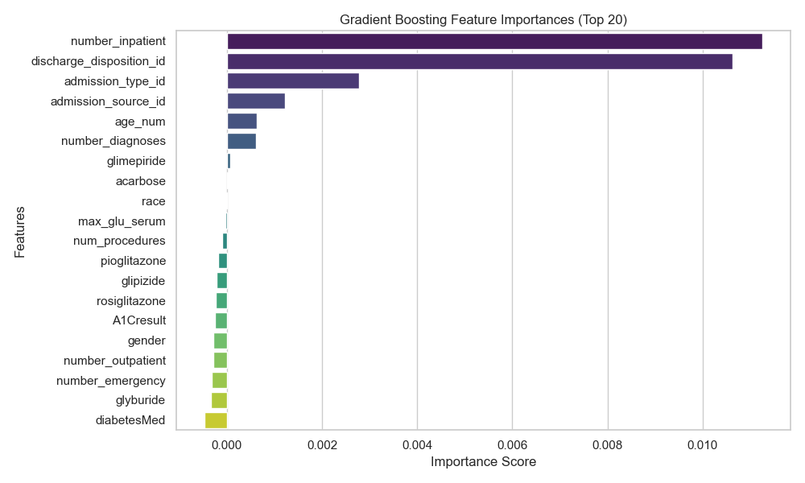

# Project Check-In (March) - Rough Draft

## 1. Preliminary Data Visualizations
We created a few initial charts to see how some of our main features relate to our target variable (whether a patient gets readmitted within 30 days). 

1. **Age Distribution by Readmission**: 
   
   We created a stacked histogram showing the age distribution of the patients in our dataset. We converted their original age brackets into numeric midpoints, so the x-axis represents age and the y-axis is the total patient count. Looking at the graph, you can see our data skews heavily older, specifically in the 60-80 range. The colors inside each bar split the patients by whether they were readmitted within 30 days or not. We used a stacked chart here so we could look at the actual *proportion* of readmissions for each age group, not just the raw counts. This helps us see if age itself really drives the readmission risk.
2. **Time in Hospital vs. Readmission Risk**:
   
   We made a boxplot to see if the length of a patient's initial hospital stay relates to their chance of coming back within 30 days. We split the patients into two groups on the x-axis: 0 for not readmitted, and 1 for readmitted. The y-axis shows how many days they were in the hospital. We chose a boxplot so we could compare the medians and the spread of those two groups right next to each other. Our initial hypothesis was that a longer initial stay usually means the patient had a more severe or complex case, which should increase the risk of a bounce-back. However, looking at the graph, the two boxes are essentially identical—both groups have a median of exactly 4 days, and the exact same spread. This is actually a very important finding: it shows us that in this dataset, the initial time spent in the hospital does *not* correlate with 30-day readmission risk, which disproves our initial theory.

## 2. Data Processing Progress
Yes, we successfully downloaded the [Diabetes 130-US hospitals dataset](https://archive.ics.uci.edu/dataset/296/diabetes+130-us+hospitals+for+years+1999-2008) from the UCI Machine Learning Repository. We actually used their official Python library (`ucimlrepo`) to pull the data directly into our pandas dataframes, which made the data ingestion super easy.

Here's exactly what we did to clean and prep the data so far:
- **Filtering features:** We narrowed down the 50ish columns in the raw dataset to just the ones we proposed in our initial plan: `age`, `time_in_hospital`, `num_procedures`, and `num_medications`.
- **Handling 'age':** The age data came in weird string buckets like `[70-80)`. To make this usable for machine learning, we wrote a function to strip the brackets and calculate the numeric midpoint (so `[70-80)` becomes `75.0`).
- **Formatting the target variable ('readmitted'):** The original labels were `NO`, `>30`, and `<30`. Since our specific goal is predicting 30-day readmissions, we mapped `<30` to `1` (positive class) and clumped `NO` and `>30` together as `0` (negative class). 
- **Handling missing data:** After selecting our features, we dropped any rows that had missing values in those specific columns to keep things clean for our baseline models. After doing all this, we were left with a solid dataset of about 101,766 patient records.

## 3. Modeling Methods
- **What we're predicting:** A binary classification model to predict if a diabetic patient will bounce back to the hospital within 30 days of leaving.
- **Features used:** The cleaned numeric versions of `age`, `time_in_hospital`, `num_procedures`, and `num_medications`.
- **Why we chose these:** We picked these starting features because logically, older age and longer time spent in the hospital usually mean someone is sicker. Combining that with the number of procedures and medications gives us a rough proxy for how complicated their case is. 
- **Our Process:** We used `scikit-learn` to randomly split the data into two sets: 80% for training the models and 20% reserved for testing. 
  - **Lines 1 - 81412**: Training Data (81412 records)
  - **Lines 81413 - 101766**: Testing Data (20354 records)
  
  We built two baseline models to start: a **Logistic Regression** and a **Random Forest Classifier**. Since "readmitted within 30 days" is actually the minority class (most people don't come back that fast), we made sure to balance the class weights during training so the models wouldn't just default to guessing "0" for everybody.

## 4. Preliminary Results & Interpretation
We ran both of our baseline models against our 20% test partition. Here are the initial test accuracy scores:
- **Logistic Regression Test Accuracy**: 56.50%
- **Random Forest Test Accuracy**: 49.80%

**Model Performance Visualization:**
To better interpret our model, we plotted a Confusion Matrix for the Random Forest evaluating against the test partition:

As visualized above, the model has a notable amount of false positives (predicting readmission when it doesn't happen). This is expected behavior given that we balanced the class weights to force the simple model to better identify the minority positive class. 

**Top Characteristics Increasing Risk:**
Based on our Random Forest model, we extracted the feature importances to analyze the top characteristics that increase readmission risk. 

In our current dataset, they are:
1. **`time_in_hospital`** (Importance Score: 0.384)
2. **`num_medications`** (Importance Score: 0.315)

**Thoughts on the results:**
To be honest, the accuracy right now isn't amazing, but that makes sense for a rough draft baseline. Predicting readmission is a notoriously hard problem, and right now we're only feeding the models four very high-level features. 

Since we told the models to treat both classes equally (by balancing the weights), they are trying really hard to correctly guess the minority class ("Yes, they will be readmitted"), which drags down the overall broad accuracy score. For the rest of the project, our plan is to start feeding the models more detailed clinical features like `HbA1c` test results or specific diabetes medications. We're also going to start looking at better evaluation metrics for imbalanced datasets—like Precision, Recall, and ROC AUC—instead of just staring at the raw accuracy number.
